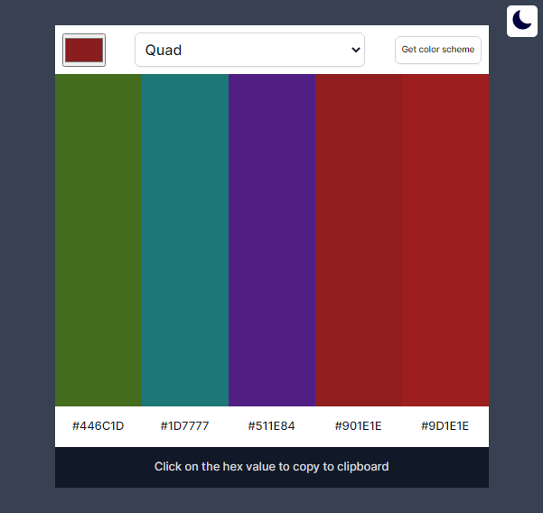
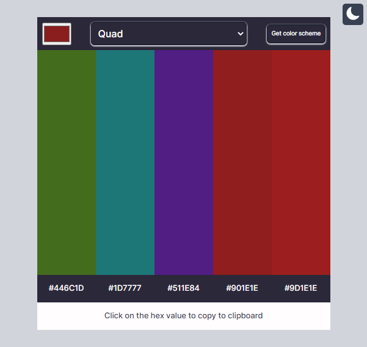

# Color-Scheme Generator App

This is a solution to the [Scrimba Color-Scheme Generator Solo Project](https://scrimba.com/allcourses).

## Table of contents

- [Overview](#overview)
  - [The challenge](#the-challenge)
  - [Screenshot](#screenshot)
  - [Links](#links)
- [My process](#my-process)
  - [Built with](#built-with)
- [Author](#author)
- [Acknowledgments](#acknowledgments)

## Overview

  Users will be able to:

- generate a color-scheme on each button click,
- choose a seed color for which the color scheme is to be generated
- copy any color scheme to clipboard on click of any of the color hex

### Screenshot

### Links

- Solution URL: [github.com/Ifescohub/color-scheme-generator](https://github.com/Ifescohub/color-scheme-generator)
- Live Site URL: [https://ifesco-colorscheme-gen.netlify.app/](https://ifesco-colorscheme-gen.netlify.app/)

## My process

### Built with

- HTML5 markup
- Pure CSS
- Vanilla JavaScript
- Flexbox
- thecolorapi

## Author

- GitHub - [Udeh Ifeanyi](https://github.com/Ifescohub)
- Frontend Mentor - [@ifescohub](https://www.frontendmentor.io/profile/Ifescohub)
- Twitter - [@UdehIfeanyi10](https://twitter.com/UdehIfeanyi10)

## Acknowledgments

I acknowledge scrimba tutors for creating a solo project challenge like this to help learnings apply what they are learning. 
You can also learn from Scrimba. Check the Links below.

- [Scrimba courses](https://scrimba.com/allcourses)
- [The Frontend Career Path](https://scrimba.com/learn/frontend)
- [Become a Scrimba Pro member](https://scrimba.com/pricing)

Happy Coding!
